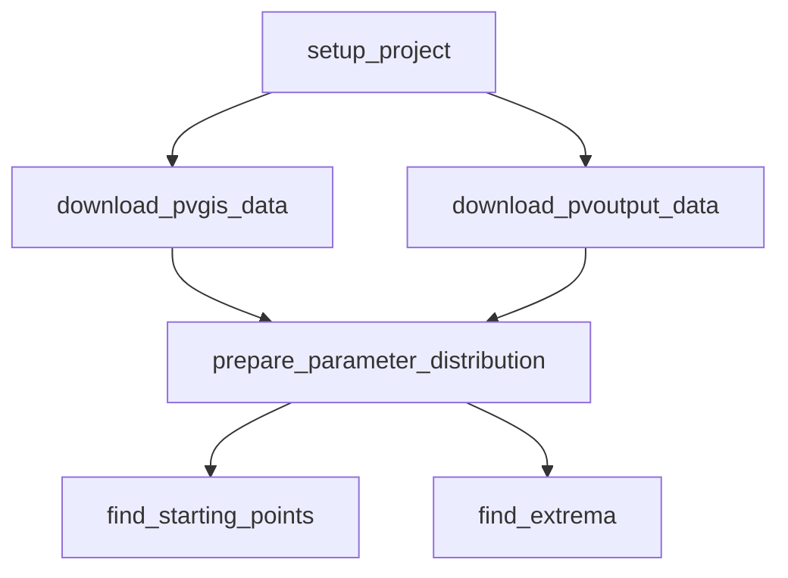

# Home

Contains all the code for the eurocast 2024 paper "Surrogates for Fair-Weather Photovoltaic Module Output".

Workflow
--------

## Sampling from Distribution

## PVGIS Data Download

- Sampling using GeoPandas Grids
- Access via `pvoutput-ofc` library. Downloading metadata
- TODO: Provide Maps for grid data and maybe heatmap based on location

* **KWp**: `Bruttoleistung` in open maestr.
* **Orientation**: Estimated based on PVGIS data. Contains categorical data (Cardinal Directions). Recalculated to degrees (between -90 and 90) using the following mapping:

-90 Degrees: East
-45 Degrees: South-East
0 Degrees: South
45 Degrees: South-West
90 Degrees: West

* **Tilt**: Maybe MeSt maybe pvoutput
* **System Loss**: Hard to estimate / on-going research. Affected by multiple sources (losses in cables, power inverters, dirt (sometimes snow), ...). PVGIS proposes a default value of 14% for fixed systems. We will use this value for now.
* **PV Technology**: The performance depends on the module type (crystalline silicon cells, thin-film cells (CIS, CIGS) or Cadmium Telluride (CdTe)) which depends on the temperature and irradiance effects on the module. 
https://www.nature.com/articles/am201082

Seems CS are by far the most common and actually deployd (90+%). The rest have a smaller share (CdtTe are around 5%). Flexible Panels (thin film) maybe should not be considered (CdTe) as they are usually used for special applications (e.g. on boats, cars, ...).
BEST REF: https://www.sciencedirect.com/science/article/pii/S007964251930101X#b0005

* **Mounting Position**: Assumed fixed as for most residential systems.

Probably limit to austria / germany / (italy) / Gran Canary
* **Longitude**: 
* **Latitude**: 

## Downloaded Data Hosting

???

## Downloading Data from PVGIS

Downloader via API and parallelized using `joblib`.
Data per observed module is downloaded from the PVOutput API. The data is then used to train the models. The data is then used to predict the output of the module. 

All data starts at 2005-01-01 and ends at 2020-12-31. The last year is used for evaluation.

## Data Exploration

- [x] Distribution of the data
- [x] What filtering was done (e.g. only residential systems, exclude lowest and highest 1% of the data)
- [x] Building the distribution based on the data

Module selection:
- Uniform distribution across country
- Random samples for each module (parameters + location)
- Random samples for a module (only parameters)

## Employed Models

- PatchTST
- NHiTs
- SymReg

- Pretrained
- Pretrained + Fine Tuned (on n years)

Input Data:
- Longitude
- Latitude
- kwP
- Orientation
- Tilt
- System Loss
- Daynumber of the year

Might look into past data (past week / days)

Output Data:
- Prediction for day number

Probably not:
- PV Technology
- Mounting Position

## EX01 - How well can models capture the output of a module / global_irradiation?

Training the models is done from 2005 - 2019. The last year is kept for evaluation.

Results:
 - Avg MSE for each model of the last year
 - Fine Tuning MSE for each model (increasing data for fine-tuning/pre-learning)

Train the models on the data and evaluate them on the last year. Add noise to the data and evaluate the models on the noisy data.
Use White noise. drift would be interesting (based on data how much loss over time)

## EX02 - How well can capture Module for different parameters?

Use ~10 Module Positions and train the models on data from different parameter configurations - probably sample 1000 configurations and evaluate the models on them. Pretraining is done on base data all over germany.

Output should be a feeling which parameters can modeled well and which not.

Idea:
  - Save a dataframe from training:
  [kwP, Orientation, Tilt, ModelName, Error]
  - Project everything but the error using dimension reduction (PCA, UMAP, t-SNE) into a two-dimensional space
  - Plot it using a heatmap, Explained Variance, ...

## EX03 - How big of an area can be covered by a single model?

Vary the longitude and latitude (positive and negative direction). Define a cutoff point (drop in performance) and plot the area that can be covered by a single model.

The area should be defined by the 3 points which are equally distributed on a cirle (or 5 for an ellipes).
Next determine the cutoff point (e.g. 10% drop in performance) and plot the area that can be covered by a single model.

Visualize the cutoff points for each 'ray'. give an approximation of the area.